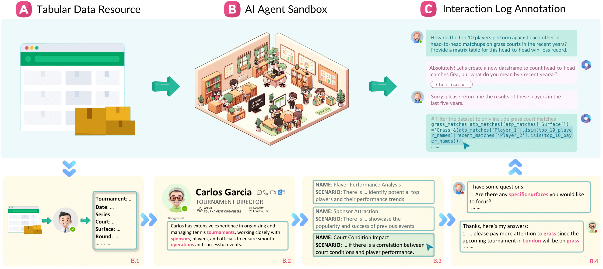

# Tapilot-Crossing: Benchmarking and Evolving LLMs Towards Interactive Data Analysis Agents


[](https://creativecommons.org/licenses/by-nc/4.0/)
[](https://bird-bench.github.io/)
[](https://www.python.org/downloads/release/python-390/)
[](https://tapilot-crossing.github.io/)
[](https://www.python.org/downloads/release/python-390/)


<p align="center" width="100%">
<a></a>
</p>

## Project Overview

Tapilot-Crossing is an innovative benchmark designed to evaluate Language Model (LLM) agent performance on interactive data analysis tasks. This project introduces a cost-effective way to simulate realistic user-agent interactions via DECISION COMPANY. Tapilot-Crossing includes 1024 human-machine interactions with 1176 user intents across four scenarios: **Normal**, **Action**, **Private**, and **Private Action**. It also features the **A**daptive **I**nteraction **R**eflection (**AIR**) strategy, aimed at improving LLM agent ability to learn from their interaction histories, leading to significant performance enhancements.

## Dataset Structure

This section outlines the structure of the `data` directory, detailing its organization across several layers and describing the contents of each.

### 1. Directory structure of `interaction_data`

### First Layer: Dataset Domains
The top level of the dataset directory is organized by dataset domains, each representing a specific area of interest. For example, `atp_tennis` is dedicated to tennis matches.

### Second Layer: Agent Profiles and Interaction Length
The next level categorizes data by agent profiles and the length of interaction:
- **Long Interactions**: Represented by profiles with extensive experience, such as "Carlos" who is noted for his expertise in organizing tennis tournaments.
- **Short Interactions**: Denoted by a prefix `short_`, indicating brief interactions with the agent, e.g., `short_Carlos`.

### Third Layer: Data Modes
Data is further organized into four modes reflecting the nature of the interaction turns:
- **Action**: Interaction turns featuring special actions (e.g., analysis, clarification requests).
- **Action_Private**: A private library version of the Action mode.
- **Normal**: Interaction turns with clear user intents that do not require any special actions.
- **Private**: A private library version of the Normal mode.

### Fourth Layer: Interaction Turns
The final layer is organized by the interaction turns themselves, providing a granular view of the dataset.

### 2. Content Files of `data`

- `interaction_data`: Contains all the interaction data of tapilot data. For each interaction turn (e.g., `turn_1_short_1` for short interactions, `turn_1` for long interactions), the following files are included:
  - `meta_data.json`: Contains metadata about the problem, including `result_type`, `action`, and `data_id`.
  - `ref_result` and `pred_result` directories: Store files (pickles or PNGs) generated from the reference and prediction codes, respectively.
  - `prompt_curr.txt`: The basic prompt for the current interaction turn used for querying large language models.
  - `prompt_curr_oracle.txt` (Optional): An enhanced version of the basic prompt that includes oracle private functions for the current interaction turn.
  - `ref_code.txt`: The ground truth solution code for the current interaction turn.
  - `eval.py`: The evaluation code specific to the current interaction turn.
  - `reference_answer.txt` (Optional): The correct answer for the current interaction turn in multi-choice format.
  - `reference` directory: Contains the interaction history and reference code:
    - `prompt_code_hist.json`: Basic prompt with interaction history in a list of dictionaries format, adhering to the standard GPT input format.
    - `prompt_code_hist.txt`: Plain text format of the basic prompt with interaction history.
    - `ref_code_hist.py`: Reference code of interaction history excluding the current turn's reference code, useful as code context for model-generated code.
    - `ref_code_all.py`: Includes the complete reference code history along with the current turn's code, serving as a comprehensive reference that can generate results for the current turn.
- `resource`: Contains all the tabular data in csv file of 5 domains of tapilot data; along with the private library named "decision_company" in python and json format.
- `rdb`: Contains the History Relational Database. We split the User-AI interaction into several singleturn user queries and AI answers stored in a relational database, indexed by the conversational order. This storage is subject to dynamic combinations for different scenarios. 

The visualization of the `tapilot_data` directory structure which should be stored in **`data/`** folder of this project.

```
data
├── interaction_data
  ├── atp_tennis
      ├── Carlos
      ├── Emma
      ├── John
      ├── short_Carlos
      ├── short_Emma
      └── short_John
          ├── short_action
          ├── short_action_private
          ├── short_normal
          └── short_private
              ├── turn_1_short_1
              ├── turn_2_short_1
              ├── turn_2_short_2
                  ├── meta_data.json
                  ├── eval.py
                  ├── ref_code.py
                  ├── prompt_curr_oracle.txt (Optional: only for private mode)
                  ├── prompt_curr.txt
                  ├── ref_result
                  ├── pred_result
                  ├── reference_answer.txt (Optional: only for multi-choice mode)
                  └── reference
                      ├── prompt_code_hist.json
                      ├── prompt_code_hist.txt
                      ├── ref_code_hist.py
                      └── ref_code_all.py (Optional: only for code generation mode)
  ├── credit_card_risk
  ├── fast_food
  ├── laptop_price
  └── melb_housing
├── resource
└── rdb
```

## Environment Setup

Before starting, ensure Python 3.10 is installed on your system. Some Python libraries are required which can be installed via pip:

```bash
conda create -n tapilot python=3.10
source activate tapilot
pip install -r requirements.txt
```

## Collect Agent Response 
### Generate responses
To evaluate the effectiveness of different Large Language Model (LLM) agents in various settings, execute them with the designated prompts and document their responses. The following steps can guide you through this process:

  - For code gen mode evaluation:

    ```bash
    sh ./run/run_code_gen.sh
    ```

  - For multi-choice mode evaluation:

    ```bash
    sh ./run/run_multi_choice.sh
    ```

This step usually generates output in a json file located in [`./output/`](./output/), where each key is the data path and value is LLM response. We include examples in the output.

### Postprocessing for LLM responses

To extract Python code from LLM responses and integrate it into the corresponding code history, preparing it for execution. Different models with different prompt may vary at this part.
  - For baseline model:

    ```bash
    sh ./run/postprocess_code_gen.py
    ```

This process creates a file named `pred_code.py` containing extracted Python code. This file is saved within the folder corresponding to each dialogue turn, facilitating easier evaluation.

## Performance Evaluation
   
### Generate Results for Evaluation
First, you need to generate results from predicted and reference code. 

  - For referenced results generation:
    
    ```bash
    sh ./run/run_reference_code.sh
    ```

  - For prediction results generation:
    
    ```bash
    sh ./run/run_prediction_code.sh
    ```

This step will execute the reference or prediction code, producing results that are saved at **`ref_result/`** or **`pred_result/`** under each dialogue turn's folder for evaluation.

### Evaluation on Each Setting
To quantitatively evaluate the performance of different models based on the results obtained from the prediction code execution. Utilizing specific `eval.py` within each dialogue turn's folder, this step facilitates a comparative evaluation of the results.

  - For code generation setting:

    ```bash
    sh ./run/eval_code_gen.sh
    ```

  - For analysis setting:

    ```bash
    sh ./run/eval_multi_choice.sh
    ```

This step generates `eval_stats.json`, which contains detailed performance evaluation located under each dialouge turn folder.

### Performance Report
To compile and summarize the performance metrics across all settings, providing a comprehensive overview of the LLM agents' capabilities. You can use:

  ```bash
  sh ./run/eval_overall.sh
  ```

## Code License

This project code is licensed under the MIT License - see the [LICENSE](LICENSE) file for details.

## Contact

Please connect [jl0725@connect.hku.hk](jl0725@connect.hku.hk) and [huonan@connect.hku.hk](huonan@connect.hku.hk) for any questions or feedbacks! We are going to release a Speech-based Data Science Benchmark in the near future. Stay Tuned!

## Acknowledgments

We thank Bowen Li and Bowen Qin for their early discussions. We also sincerely thank [Prof. Laks V.S. Lakshmanan](https://scholar.google.ca/citations?hl=en&user=_RCsaOsAAAAJ&view_op=list_works&sortby=pubdate) and [Dr. Xiaodong Li](https://scholar.google.com.hk/citations?user=fkz22zYAAAAJ&hl=en) for their suggestions. The background music of the video has been licensed. Please contact the first authors for copyright inquiries.


## Citation

Please cite the repo if you think our work is helpful to you.

```
@article{li2024tapilot,
  title={Tapilot-Crossing: Benchmarking and Evolving LLMs Towards Interactive Data Analysis Agents},
  author={Li, Jinyang and Huo, Nan and Gao, Yan and Shi, Jiayi and Zhao, Yingxiu and Qu, Ge and Wu, Yurong and Ma, Chenhao and Lou, Jian-Guang and Cheng, Reynold},
  journal={arXiv preprint arXiv:2403.05307},
  year={2024}
}
```
